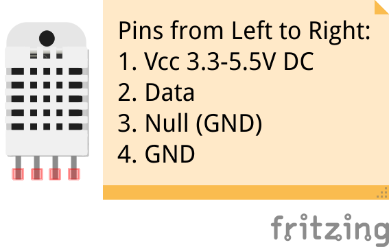

# Installation of DHT22 (AM2303)

## Installation
Install the [DHT22](https://cdn-shop.adafruit.com/datasheets/DHT22.pdf) by executing the following commands:
```shell
# Will install Adafruit's CircuitPython-DHT and Raspberry Pi's GPIO libraries into the virtual environment
(pinode-env) $ python manage.py install_dht22

```
You may have to reboot your system.

Link to [Adafruit's CircuitPython](https://github.com/adafruit/Adafruit_CircuitPython_DHT) on GitHub

## Wiring



Wire pins 1, 2 and 4 accordingly to your Raspberry Pi. Remember which pin number you chose for data and configure your sensor accordingly in your node's configuration.
For example if you use the pin number 18, its name is `GPIO24`. So in the configuration, you have to fill *24* and not 18.

## Raspberry Pi pinouts
This GPIO pinouts schema is valid for all 40 pins Rpi models from 2014. Align your board with the little squared pin, on the top left. 

