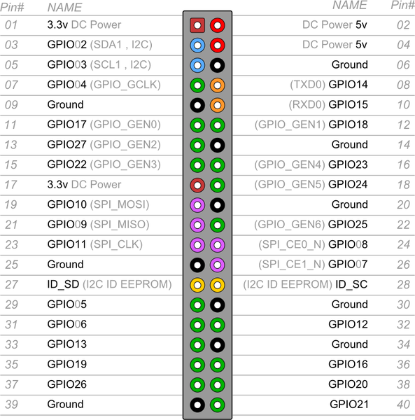

# Installation of DHT22 (AM2303)

## Installation
Install the [DHT22](https://cdn-shop.adafruit.com/datasheets/DHT22.pdf) by executing the following commands:
```shell
# Install Adafruit's CircuitPython-DHT library into the virtual environment
(pinode-env) $ pip3 install adafruit-circuitpython-dht
# You may have to install library to use GPIO pins
$ sudo apt-get install libgpiod2
```
Link to [Adafruit's CircuitPython](https://github.com/adafruit/Adafruit_CircuitPython_DHT) on GitHub

## Wiring


Wire pins 1, 2 and 4 accordingly to your Raspberry Pi. Remember which pin number you chose for data and configure your sensor accordingly in your node's configuration.

## Raspberry Pi pinouts
This GPIO pinouts schema is valid for all 40 pins Rpi models from 2014. Align your board with the little squared pin, on the top left. 

